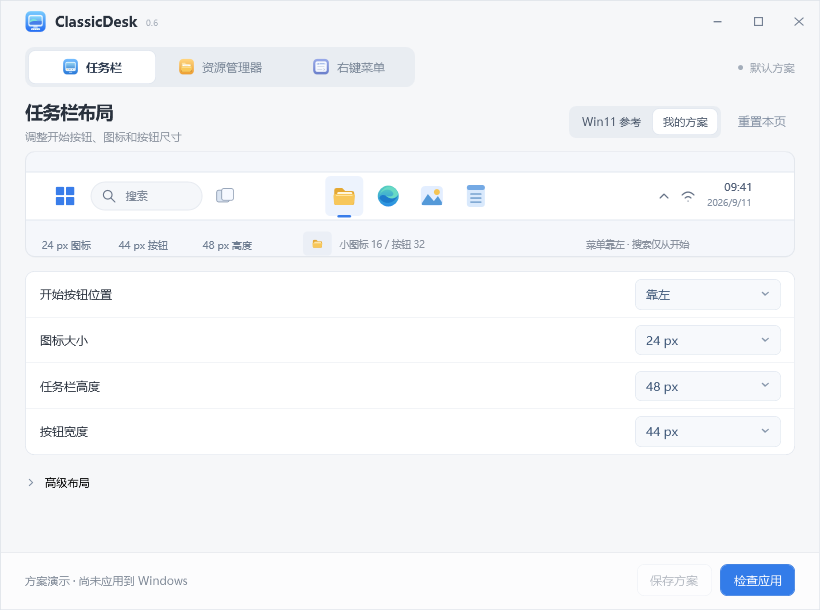
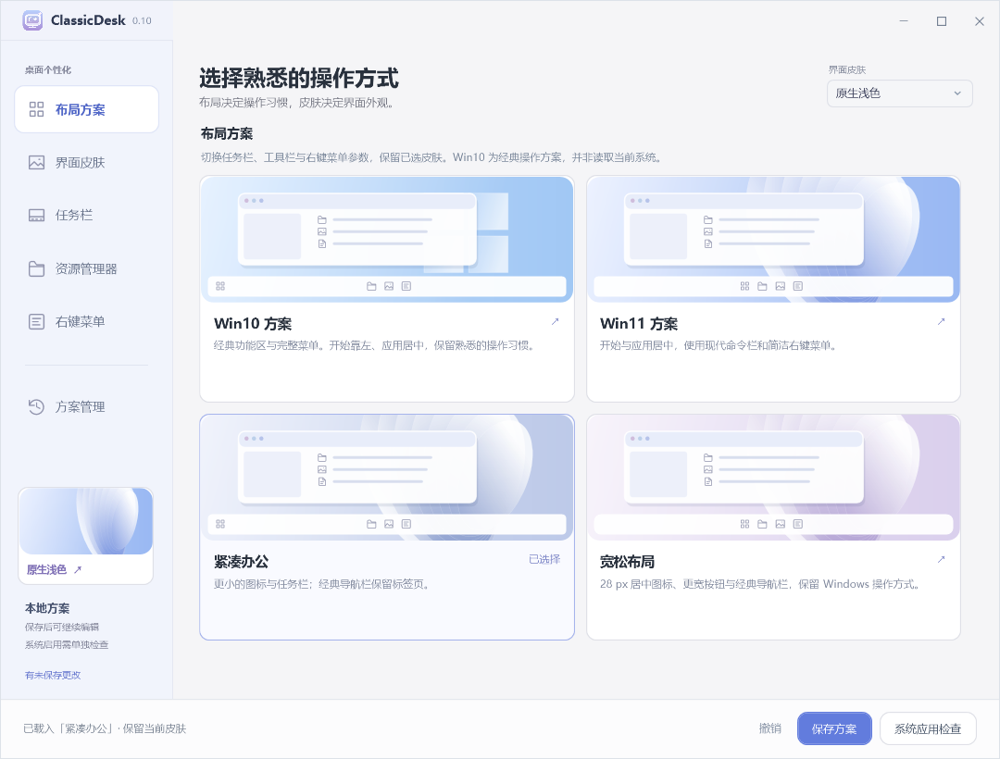
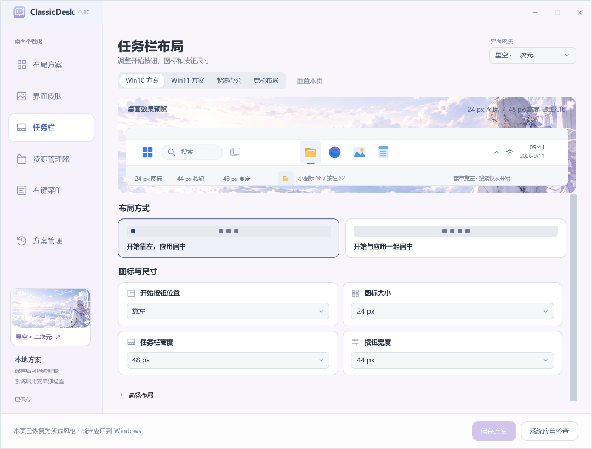
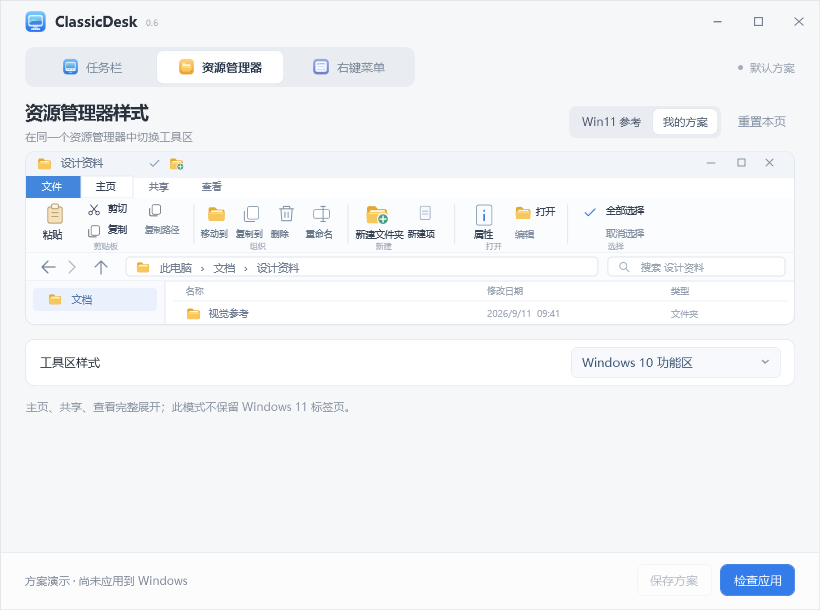
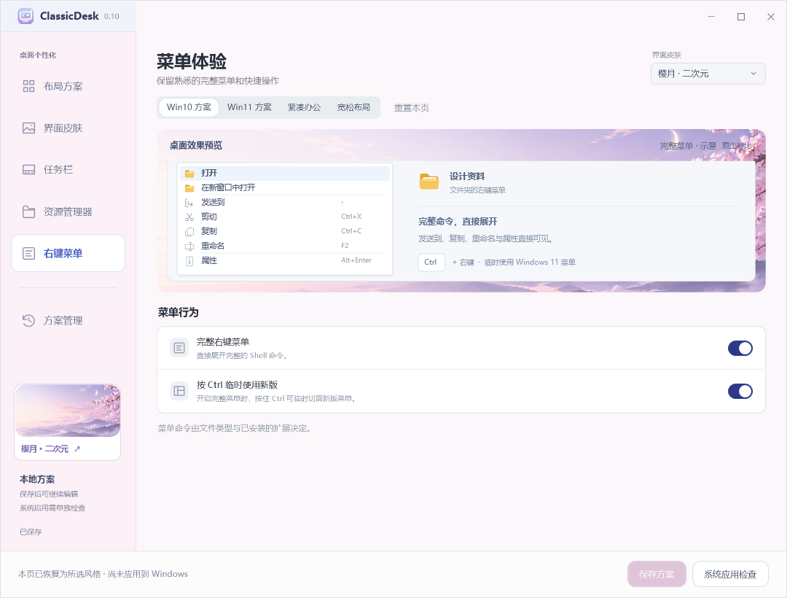

# ClassicDesk 0.10.0 界面开发版

源码与本地 **0.11.3-dev** 已加入[本地方案库](docs/PROFILE_LIBRARY.md)、[按需启用功能](docs/FEATURE_SELECTION.md)和[登录恢复](docs/LOCAL_RUNTIME.md#登录后继续已有增强)：方案可命名保存、更新、复制、重命名和归档；任务栏布局、尺寸、资源管理器和右键菜单可分别选择应用。0.11.3 修复登录时无关注册表更新时间导致的规则误判，并核对完整已应用规则。新增功能尚未发布到下面的 0.10.0-preview 下载包；公开下载继续保留原版本。

0.10 采用紫色星光显示器应用图标，保留线性导航图标和彩色文件预览图标，并将布局方案与界面皮肤独立管理。换肤保留图标和布局参数，换布局保留皮肤；支持 Win10 方案搭配星空、樱月等皮肤。

设置页顶部提供 Win10 方案、Win11 方案、紧凑办公、宽松布局四个入口；右上角选择皮肤。侧栏新增独立皮肤资料库，包含原生浅色、雾白极简、星空二次元、樱月二次元、云海二次元、月夜二次元。新增三款二次元背景均无人物。

本地开发版已采用左侧分类导航、固定预览、分组设置和底部操作区。本次以 0.10.0-preview 预览版同步源码及 Windows 运行包，保留历史版本。

## 本版新增

- **布局与皮肤**：四种布局、六款皮肤自由组合，随 JSON 保存和导入导出。旧版星空方案在内存中拆分为布局标识与皮肤，保留每项功能参数，保存前不改写旧文件。
- **方案管理**：查看三类设置摘要及修改项；导入 JSON、导出当前草稿、载入上一份保存记录。
- **预览与编辑**：设置页的预览固定在上方，高级参数独立滚动；每项参数显示简短说明，保留 Windows 11 参考对比。
- **按布局重置**：重置本页恢复所选布局的默认参数，保留其他页面的设置与当前皮肤。
- **快捷键**：Ctrl+S 保存，Ctrl+O 导入，Ctrl+Shift+S 导出。

导入先验证文件格式、参数名称、重复项和取值，失败不改变草稿；导出不改变当前方案的保存状态；载入历史方案后需要再点击“保存方案”才会写回。保存继续保留外部修订检查与上一份原始文件备份。

以上功能用于方案编辑与预览，不会自动修改 Windows，也不包含 StartAllBack 的程序、图标或增强引擎。系统启用仍通过“系统应用检查”进入原有流程。

[← 返回 portfolio](https://github.com/turnsolesama/portfolio) · [Releases · v0.10.0-preview](https://github.com/turnsolesama/classicdesk/releases/tag/v0.10.0-preview)

ClassicDesk 定位为 Windows 桌面修改工具，面向任务栏、资源管理器与右键菜单的外观和布局调整。当前公开预览版提供布局与皮肤管理、三类设置编辑与原创参数图示，采用 C# / WPF 实现。

**这个下载包可用于预览和保存方案，没有捆绑 Windhawk 等第三方增强运行组件，因此当前公开包不能直接启用真实桌面改造。** 原生宿主与恢复代码已纳入源码，本地已验证部分单屏效果，完整实机验收仍未完成。图片是示意图，不是系统效果截图。

## 界面预览

以下为应用离屏界面，展示方案编辑和原创参数图示，未应用到 Windows。








插画素材及生成提示词见 [星空素材说明](docs/ARTWORK.md) 与 [新增皮肤素材说明](docs/SKIN-ARTWORK.md)。

<details>
<summary>查看资源管理器与右键菜单页面</summary>





</details>

## 下载

[Windows x64 预览版 ZIP](https://github.com/turnsolesama/classicdesk/releases/download/v0.10.0-preview/ClassicDesk-0.10.0-preview-windows-x64.zip) · [SHA-256 校验](https://github.com/turnsolesama/classicdesk/releases/download/v0.10.0-preview/SHA256SUMS.txt)

## 运行

1. 使用 Windows 11 x64。
2. 安装 [Microsoft .NET 8 Desktop Runtime x64](https://dotnet.microsoft.com/en-us/download/dotnet/8.0)。发布包复用系统运行时，不包含 SDK 或 .NET 运行时。
3. 解压下载的前端 ZIP，运行 `app/ClassicDesk.exe`。保留旁边的 DLL、deps.json 和 runtimeconfig.json。

设置窗口关闭后前端退出，没有自有 Dock、托盘驻留或自动启用任务。未来真正启用增强时，独立增强引擎仍需运行；前端退出不等于增强引擎退出。

## 当前功能

| 页面 | 已实现的方案参数 |
| --- | --- |
| 任务栏 | 开始按钮布局、图标大小、任务栏高度、普通/小图标按钮宽度、小图标尺寸、其他系统按钮位置、开始与搜索菜单位置 |
| 资源管理器 | Windows 11 原样、经典 Ribbon、早期 Windows 11 导航栏三种互斥方案 |
| 右键菜单 | 经典菜单方案与 Ctrl 切换策略 |

- 草稿跨页面保留；保存、撤销、待保存状态及失败反馈可用。
- 方案默认保存在 `%LOCALAPPDATA%/ClassicDesk/ShellProfile.json`。保存前核对文件修订，外部修改会拒绝覆盖；前一份方案保存在 `.previous`。损坏配置保留原文件。
- 参数与图示联动；提供只读环境/方案检查。缺少组件时明确提示，禁止假报“已应用”。
- 可在新目录生成完整停用配置：主/引擎 SafeMode=1，四个模块 Disabled=1。这不会下载、安装或启动引擎。

```powershell
& .\app\ClassicDesk.exe --prepare-disabled-config C:\Temp\ClassicDesk-disabled
# 可在末尾附加一个已存在的方案 JSON 文件路径。
```

目标目录必须全新且不存在。没有无交互启用参数。

## 真实启用与恢复的边界

源码包含固定 Windhawk 1.7.3 协议的包校验、七目标事务、原始字节备份、写入归属、进程身份检查与恢复实现。真正启用需要匹配已审查清单的独立增强包，并由用户明确点击。此公开版本暂不提供该增强包，不能使用任意 Windhawk 安装目录替代。

已有 StartAllBack 正在加载、其他增强实例、读取不完整、包/配置修订变化或未完成记录都会阻止冲突操作。不会替用户停用 StartAllBack、绕过激活、重启 Explorer、强停其他进程或安装自启动。安装存在本身不代表冲突，完整检查明确未加载时可以保留原安装。

恢复仅处理本工具确认拥有且没有被外部修改的状态。未知写入/启动/退出结果进入待人工检查；文件锁和修订检查不是操作系统原子 CAS。实际 Ribbon、任务栏与菜单效果、重启后的行为、多显示器和不同 Windows 构建仍待验证。

## 构建与测试

构建需要 Windows 和 [.NET 8 SDK](https://dotnet.microsoft.com/en-us/download/dotnet/8.0)。没有第三方 NuGet 依赖。

```powershell
dotnet build src/ClassicDesk/ClassicDesk.csproj -c Release
dotnet publish src/ClassicDesk/ClassicDesk.csproj -c Release --no-self-contained -o artifacts/app
powershell -NoProfile -ExecutionPolicy Bypass -File scripts/Test.ps1
```

测试由四个独立项目组成：事务核心、真实文件加 fake 系统接口、WPF 离屏交互、缺组件发布边界。测试不显示应用窗口、不调用真实注册表写入、不启动增强引擎。测试生成的本地报告与夹具不应提交到仓库；它们可能含运行机器路径。

## 源码结构

- `src/ClassicDesk/`：默认前端、独立主题、原创图标与宿主适配。
- `tests/`：可移植隔离测试；不依赖开发者原本的组件目录。
- `scripts/Test.ps1`：一键运行四组检查。
- [THIRD_PARTY.md](THIRD_PARTY.md)：外部增强组件与公开分发边界。
- [V2_ROADMAP.md](V2_ROADMAP.md)：下一版的小步目标与验收条件。

此版本是供审查、反馈与继续开发的初版。它没有把原 StartAllBack 设置界面嵌入应用，也没有包含其程序或授权数据。

## 权利说明

初版采用版权保留方式公开源码，尚未选择开源许可证，见 [LICENSE](LICENSE)。第三方权利归原作者；公开前端不改变上游许可。预览程序尚未提供代码签名，可按发布材料的 SHA-256 核对文件。
