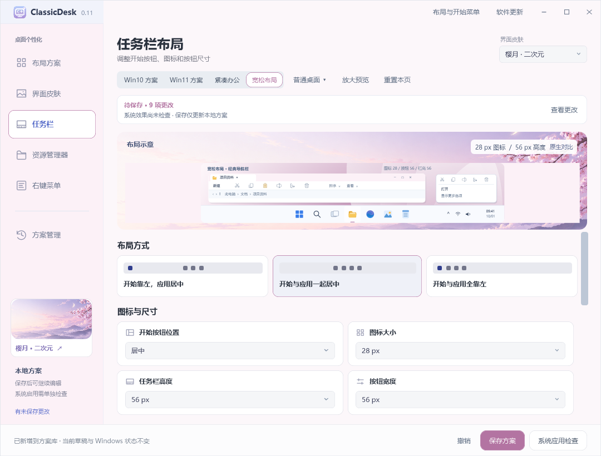
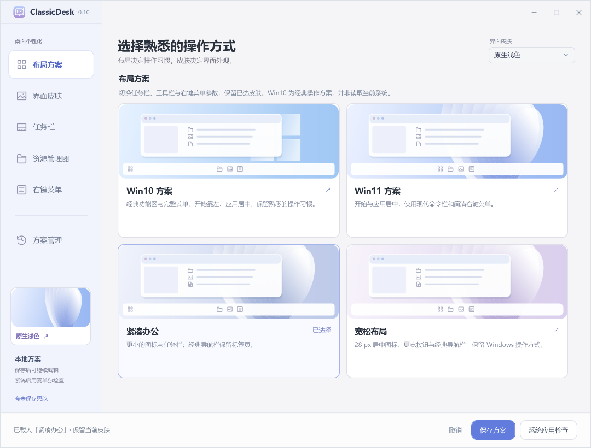
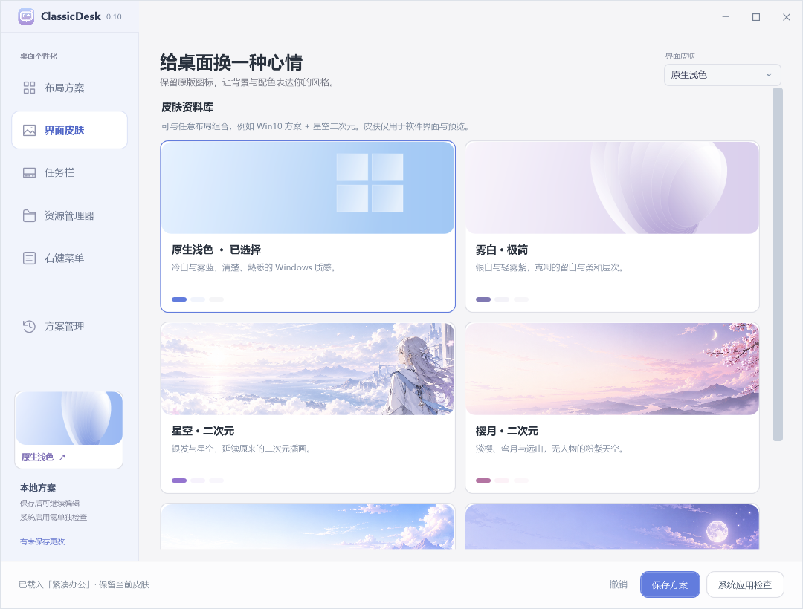
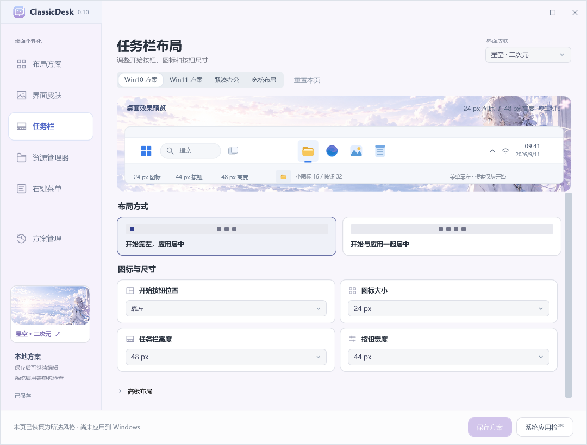
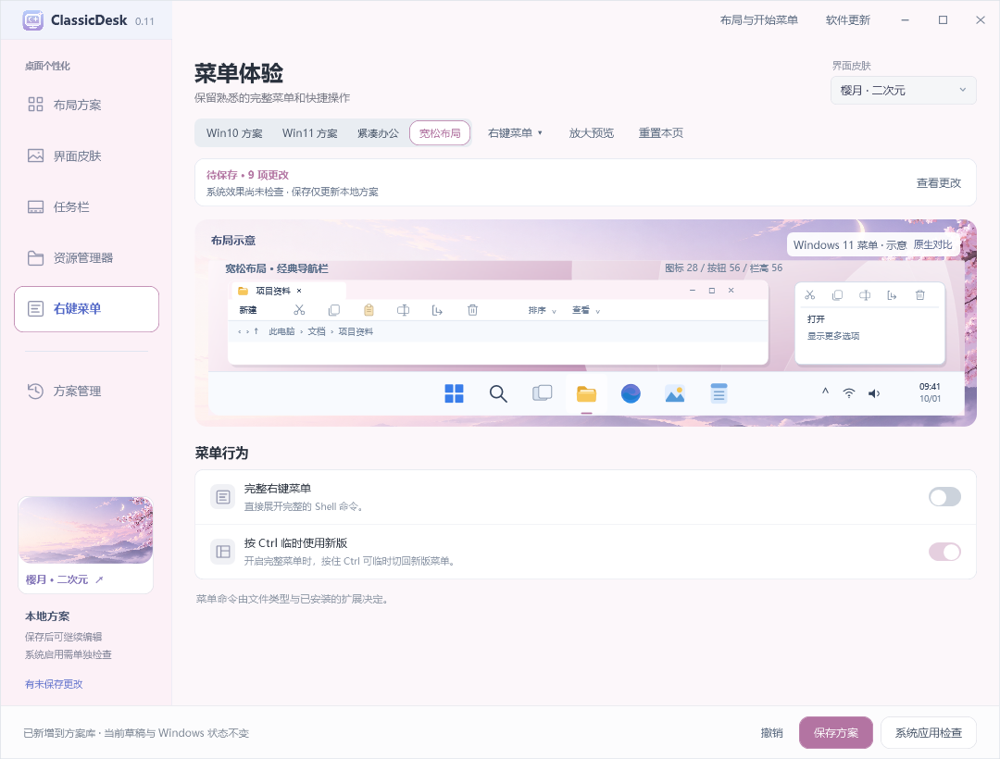

# ClassicDesk · Windows 桌面布局与外观工具

> **0.11.20-preview · 前端与方案预览版**：[焦点与菜单修复](docs/FOCUS_AND_MENU.md)、[随设置变化的桌面效果图与方案卡片](docs/PROFILE_VISUAL_PREVIEW.md)、[独立开始菜单与布局编辑](docs/LOCAL_PARITY_FEATURES.md)、[前端软件更新](docs/FRONTEND_UPDATES.md)。保存和预览不会自动向 Windows 应用设置；原生 Alt/Popup、管理员组件及完整系统替代仍未实机验收。

设置页上方的桌面示意随草稿立即变化，“放大预览”进入方案页的大图。编辑小图标、开始/搜索定位、最大化不透明和 Ctrl 菜单参数时，自动切到对应场景；也可以用图上方的状态菜单自行切换。自己的方案有名称、缩略图和预览按钮；复制、重命名、更新与归档在各自卡片的“更多”菜单中。

效果图使用原创矢量绘制，表示当前编辑方案的大致布局；皮肤配色不代表 Windows 壁纸已改变，图中的程序、文件、时间和菜单内容都是合成示意。原方案文件格式与草稿保存、撤销、导入导出保持兼容。

此前 **0.11.16-preview** 的全靠左布局、独立原生自动隐藏及 Windows 任务栏合并/文字标签设置入口保留。详见 [功能说明](docs/LOCAL_TASKBAR_FEATURES.md) 与 [验证记录](VALIDATION.md)。本版以已测程序文件发布，只调整公开文档和更新登记，没有在发布收尾阶段重新构建。

[下载 Windows x64 预览版](https://github.com/NOXEVYR/classicdesk/releases/tag/v0.11.20-preview) · [历史版本](https://github.com/NOXEVYR/classicdesk/releases) · [功能对照](docs/STARTALLBACK_PARITY.md)

## 本版新增

- **方案卡片与参数效果图**：当前草稿的大图、保存方案的缩略图以及七种场景；相关设置自动展开小图标、开始/搜索、最大化和 Ctrl 菜单示意，未向 Windows 提交。
- **主题菜单与焦点**：纯容器退出 Tab 序列，交互控件保留主题焦点；场景/更多菜单、分隔线、选项和长提示统一皮肤，修复混合菜单容器异常。
- **编辑失败与键盘处理**：更新偏好保存失败回读实际状态；Esc 先交给控件；页面重建和重命名避免无关抢焦点。真实鼠键及 Popup 仍待验收。
- **独立 ClassicStart**：搜索、分类、固定、常用位置、自定义文件夹及样式设置。未接管 Windows 开始按钮或 Win 键。
- **任务栏与托盘设计**：四边、合并/标签、边距、分段和入口设计可编辑、保存及预览；未接入真实任务栏后端。
- **前端更新与原功能**：官方预览通道的四程序文件差异更新清单；保留六皮肤、旧方案格式、导入导出、草稿/并发保护与此前任务栏功能。实际在线安装和 WPF 重启仍待验收。

**这是预览版，尚不能完整替代 StartAllBack。** 公开包不含第三方增强运行组件，任务栏增强、资源管理器和右键菜单的实际启用仍需匹配已审查的独立组件包。原生自动隐藏为独立功能，但 StartAllBack/StartIsBack 正在加载或宿主检查失败时会拒绝写入。

保存草稿不等于系统已应用。自动隐藏只有显式点击应用/恢复才修改状态；不安装服务、不自动停用其他软件、不重启 Explorer。Explorer 会话变化、未知结果或外部修改会阻止恢复。真实触边、多屏、DPI、睡眠唤醒和长期稳定性仍待验收。

历史版本的实机记录保存在验证文档中，不代表本版在每台电脑已验收。Windows x64 前端需要 .NET 8 Desktop Runtime x64。
## 界面预览

以下为应用离屏界面，展示方案编辑和原创参数图示，未应用到 Windows。










插画素材及生成提示词见 [星空素材说明](docs/ARTWORK.md) 与 [新增皮肤素材说明](docs/SKIN-ARTWORK.md)。

<details>
<summary>查看资源管理器与右键菜单页面</summary>




</details>

## 下载

[Windows x64 · 0.11.20-preview ZIP](https://github.com/NOXEVYR/classicdesk/releases/download/v0.11.20-preview/ClassicDesk-0.11.20-preview-windows-x64.zip) · [公开源码 ZIP](https://github.com/NOXEVYR/classicdesk/releases/download/v0.11.20-preview/ClassicDesk-0.11.20-preview-source-public.zip) · [SHA-256 校验](https://github.com/NOXEVYR/classicdesk/releases/download/v0.11.20-preview/SHA256SUMS.txt)

## 运行

1. 使用 Windows 11 x64。
2. 安装 [Microsoft .NET 8 Desktop Runtime x64](https://dotnet.microsoft.com/en-us/download/dotnet/8.0)。发布包复用系统运行时，不包含 SDK 或 .NET 运行时。
3. 解压下载的前端 ZIP，运行 `app/ClassicDesk.exe`。保留整个 app 目录，包括 DLL、JSON、开机管理脚本和恢复入口。

设置窗口关闭后前端退出，没有自有 Dock、托盘驻留或自动启用任务。未来真正启用增强时，独立增强引擎仍需运行；前端退出不等于增强引擎退出。

## 当前功能

| 页面 | 已实现的方案参数 |
| --- | --- |
| 任务栏 | 开始按钮布局、图标大小、任务栏高度、普通/小图标按钮宽度、小图标尺寸、其他系统按钮位置、开始与搜索菜单位置 |
| 资源管理器 | Windows 11 原样、经典 Ribbon、早期 Windows 11 导航栏三种互斥方案 |
| 右键菜单 | 经典菜单方案与 Ctrl 切换策略 |

- 草稿跨页面保留；保存、撤销、待保存状态及失败反馈可用。
- 方案默认保存在 `%LOCALAPPDATA%/ClassicDesk/ShellProfile.json`。保存前核对文件修订，外部修改会拒绝覆盖；前一份方案保存在 `.previous`。损坏配置保留原文件。
- 参数与图示联动；提供只读环境/方案检查。缺少组件时明确提示，禁止假报“已应用”。
- 可在新目录生成完整停用配置：主/引擎 SafeMode=1，四个模块 Disabled=1。这不会下载、安装或启动引擎。

```powershell
& .\app\ClassicDesk.exe --prepare-disabled-config C:\Temp\ClassicDesk-disabled
# 可在末尾附加一个已存在的方案 JSON 文件路径。
```

目标目录必须全新且不存在。没有无交互启用参数。

## 真实启用与恢复的边界

源码包含固定 Windhawk 1.7.3 协议的包校验、七目标事务、原始字节备份、写入归属、进程身份检查与恢复实现。真正启用需要匹配已审查清单的独立增强包，并由用户明确点击。此公开版本暂不提供该增强包，不能使用任意 Windhawk 安装目录替代。

已有 StartAllBack 正在加载、其他增强实例、读取不完整、包/配置修订变化或未完成记录都会阻止冲突操作。不会替用户停用 StartAllBack、绕过激活、重启 Explorer、强停其他进程或安装自启动。安装存在本身不代表冲突，完整检查明确未加载时可以保留原安装。

恢复仅处理本工具确认拥有且没有被外部修改的状态。未知写入/启动/退出结果进入待人工检查；文件锁和修订检查不是操作系统原子 CAS。实际 Ribbon、任务栏与菜单效果、重启后的行为、多显示器和不同 Windows 构建仍待验证。

## 构建与测试

构建需要 Windows 和 [.NET 8 SDK](https://dotnet.microsoft.com/en-us/download/dotnet/8.0)。没有第三方 NuGet 依赖。

```powershell
dotnet build src/ClassicDesk/ClassicDesk.csproj -c Release
dotnet publish src/ClassicDesk/ClassicDesk.csproj -c Release --no-self-contained -o artifacts/app
powershell -NoProfile -ExecutionPolicy Bypass -File scripts/Test.ps1
```

`scripts/Test.ps1` 包含 Core、Host、Frontend、VisualPreview、FocusMenu、ReleaseBoundary、ServiceUI、AutoHide、ColdUpgrade、UpdatesFeed、UpdatesInstall、UpdatesUI、StartCore、StartUI、LayoutDesign 十五组隔离检查。已有最终记录为832通过/0失败；最后五组范围复测245/0，重叠检查不累计。另有 `tests/ShellService` 离线服务包测试，需要已核对的预备包和全新输出目录，本版未执行真实管理员组件安装。测试不显示应用窗口、不写真实系统设置、不启动增强引擎。运行报告与夹具可能含机器路径，不提交公共仓库。

## 源码结构

- `src/ClassicDesk/`：默认前端、独立主题、原创图标与宿主适配。
- `tests/`：可移植隔离测试；不依赖开发者原本的组件目录。
- `scripts/Test.ps1`：一键运行基础检查；传入 `-ServiceBundle` 可追加离线服务包和模拟安装检查。
- [THIRD_PARTY.md](THIRD_PARTY.md)：外部增强组件与公开分发边界。
- [V2_ROADMAP.md](V2_ROADMAP.md)：下一版的小步目标与验收条件。

此版本用于审查、反馈和继续开发；保留历史版本，仍为 prerelease。它没有把 StartAllBack 设置界面嵌入应用，也没有包含其程序或授权数据。

## 权利说明

前端及 C# 宿主采用版权保留方式公开源码，见 [LICENSE](LICENSE)；[原生模块源码](native/README.md) 按其 GPL-3.0-or-later 声明提供。第三方权利归原作者；公开前端不改变上游许可。预览程序尚未提供代码签名，可按发布材料的 SHA-256 核对文件。
