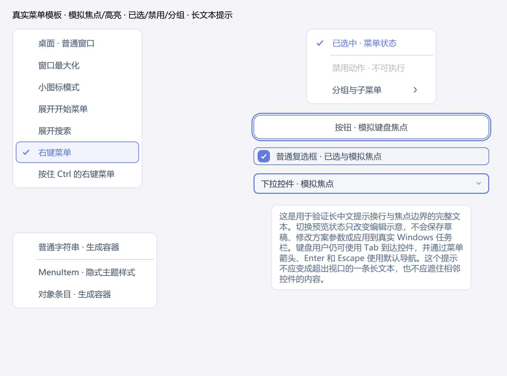
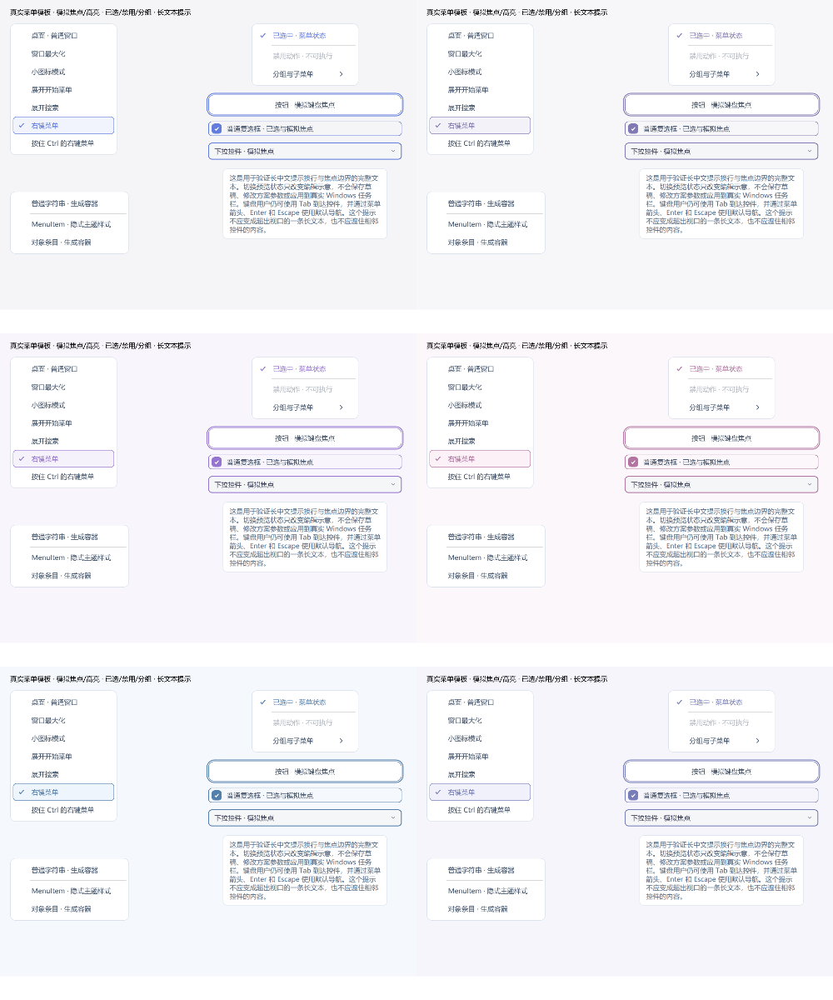

# 焦点与弹出界面检查

0.11.20-preview 将方案状态菜单和方案“更多”菜单接入同一套圆角、字体、留白、勾选与禁用样式；菜单打开时读取当前界面皮肤配色。滚动容器不再参与键盘焦点，按钮、输入框、下拉选项、复选框、列表项与滑块仍有可见焦点提示。未屏蔽 Alt，保留菜单和窗口的标准快捷键。

长提示文字可在提示框内换行。开始菜单先让编辑控件处理 Esc，未处理时才退出选项、清空搜索或请求关闭。自动更新偏好保存失败后，勾选状态回到实际已保存值并显示失败原因。设置页重建仅恢复当前激活窗口内的原焦点；重命名的名称全选只在该次重命名请求执行。

检查采用合成方案、故障注入、模板布局与 WPF 离屏渲染。覆盖六款皮肤、窄窗口和缩放输出，报告分别记录完整回归与复测，不重复累计。没有显示真实测试窗口、发送真实鼠键、设置任务栏自动隐藏、启用增强、安装服务或重启 Explorer。

离屏模板和合成事件不能替代原生 Alt、真实弹出窗口、输入法候选、多屏 DPI 和屏幕阅读器验收。替换前端后，请用实际窗口比对 Alt 后的焦点、Tab/Shift+Tab、菜单方向键/Enter/Esc、长提示与原有方案保存；这些结果需要实机确认。

